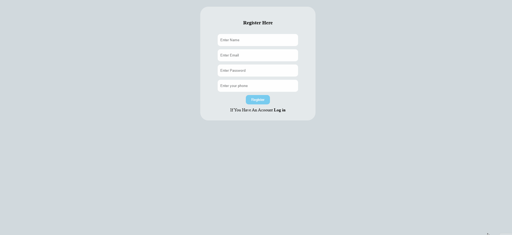
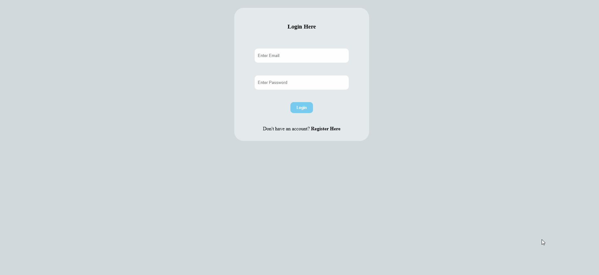

# Blog System (PHP & MySQL)

## 🚀 Overview
A simple blog system built using PHP and MySQL with authentication and CRUD operations.

---

## ✨ Features
- User Authentication (Register / Login)
- Form Validation (Error Handling)
- Create, Edit, Delete Posts
- View All Posts

---

## 🛠️ Tech Stack
- PHP
- MySQL
- HTML, CSS

---

## 🎥 Demo

---

## 📸 Screenshots

### 🔐 Authentication

### 📝 Posts

---

## ⚠️ Notes
This project is under development.
